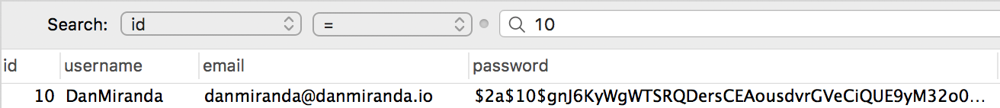
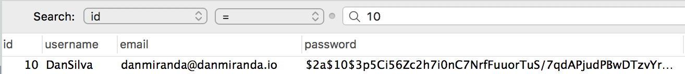
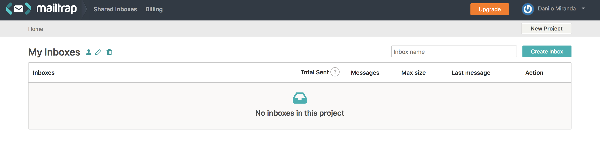
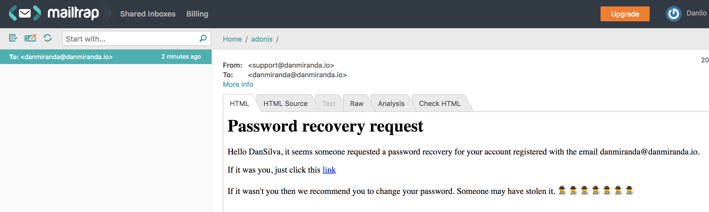

This is the second post of the series about creating an API using AdonisJS. If youd didn't read the first part here is the link [Building an API with AdonisJS](https://danmiranda.io/bulding-an-api-with-adonisjs/).

Now let's continue with the second part. Here we will learn how to:

- Update the user information (PUT request)
- Recover user's password
- Send emails with Adonis
- Work with migration to update a table structure

## Updating user information

Let's start by creating the controller that will allow the user to update his information, like his username and password (in this application the user won't be allowed to update his email).

The logic behind will be very simple:

- The user will send in the request, his new desired username, his current password and the new desired password.
- We'll then search for the user in the database
- Then we check if the current password provided is correct and then update his information with the new provided password

In order to create a new controller, we need to run the following Adonis' command:

```bash
adonis make:controller UpdateUserInfo --type http
```

Now we can go to the file `app/controllers/http/UpdateUserInfoController.js` and start coding:

Let's make sure we import our `User` model and we'll also use an Adonis' helper called `Hash`. 

Hash will be responsible for hashing the new provided password, for security reasons.

```javascript
'use stric'

const User = use('App/Models/User')
const Hash = use('Hash')
```

Our controller will only require an `update` method, so inside our controller `UpdateUserInfoController` let's begin by creating our method:

```javascript
class UpdateUserInfoController {
  async update ({ request, response, params }) {
```

And with our logic in mind, we do the following:

1. Let's get the new info sent by the user in the request:

2. ```javascript
   const id = params.id
       const { username, password, newPassword } = request
         .only(['username', 'password', 'newPassword'])
   ```

3. Now look for the user in database (using the id):

   ```javascript
   const user = await User.findByOrFail('id', id)
   ```

4. Check if password provided matches with the current one:

   ```javascript
   const passwordCheck = await Hash.verify(password, user.password)
   
   if (!passwordCheck) {
         return response
           .status(400)
           .send({ message: { error: 'Incorrect password provided' } })
       }
   ```

5. With the password check done, we are able to update the users information:

   ```javascript
   // updating user data
       user.username = username
       user.password = newPassword
   ```

6. To finish all we just need to persist the data in the database, by using the `.save()` method.

   ```javascript
   await user.save()
   ```

Your `UpdateUserInfoController.js` should look like this now:

```javascript
'use strict'

const User = use('App/Models/User')
const Hash = use('Hash')

class UpdateUserInfoController {
  async update ({ request, response, params }) {
    const id = params.id
    const { username, password, newPassword } = request
      .only(['username', 'password', 'newPassword'])

    // looking for user in DB
    const user = await User.findByOrFail('id', id)

    // checking if old password informed is correct
    const passwordCheck = await Hash.verify(password, user.password)

    if (!passwordCheck) {
      return response
        .status(400)
        .send({ message: { error: 'Incorrect password provided' } })
    }

    // updating user data
    user.username = username
    user.password = newPassword

    // persisting new data (saving)
    await user.save()
  }
}

module.exports = UpdateUserInfoController

```

Perfect! Now let's test our controller. Head to `start/routes.js` file

One thing that's really important here is that, some of our routes will only be accessible by an authenticated user, and Adonis' routing has a perfect method to deal with this, called `group()`. With `group` you can call a method called `middleware` and pass as an argument an array containing which middlewares should run before accesing the routes inside the group method.

```javascript
Route.group(() => {
  // updating username and password
  Route.put('users/:id', 'UpdateUserInfoController.update')
}).middleware(['auth'])
```

In our case, we only need the auth method, that's provided by default by Adonis. In a few moments we will test this route without and with an user athenticated

First, let's test this route without being authenticated:

This is the new information I want to save for my user:

```json
{
	"password": "123456",
	"newPassword": "123",
	"username": "DanSilva"
}
```

> I won't show here how to send the request using Insomnia because I already did so in the first part

If I send the request while not being authenticated I'll receive a 401 error (unauthorized). For this to work, I must provide, within the request, a JWT token that I get when I sign in, so make sure to sign in to test this route.

After you sign in, copy the token the request returned to you. Create a new PUT method in Insomnia and right below the request URL there is a tab called "Auth". In the dropdown menu that opens select `Bearer Token` and in the token field paste the token you just copied.

Before we send the request again, let's look at our user's data in the database to make sure it updated after our request.



Perfect. Now let's send the request. Just make sure that your URL is following this strucure

`base_url/users/YOUR_USER_ID_HEre`

Now send the request. If suceeded the request will return a 204, as we didn't set any message to return.



See? The new user info is saved in our database!

## Sending emails with AdonisJS

Before we continue to the part where we will create the controller to request a passsword recovery and set a new password with this recovery let's see how we configure Adonis to send emails.

The email provider is not installed by default so we must proceed with its installation. To do so just run the following command:

```bash
adonis install @adonisjs/mail
```

Now we need to register the new provider in our application. Our providers array is located at `start/app.js`. Open that file and find the variable called `providers`. This variable is an array containing all the providers essential to make adonis work properly. Just add the following provider at the end of this array:

```javascript
'@adonisjs/mail/providers/MailProvider'
```

We still need to configure a few things before we can continue. We need a client to test the functionality of sending emails and there is a perfect tool suited for this task. 

We will use [Mailtrap](https://mailtrap.io/). Mailtrap is, as stated in their own website:

> Mailtrap is a **fake SMTP** server to test, view and share emails sent from the development and staging environments without spamming real customers.

When you create your account and go to https://mailtrap.io/inboxes you'll see a page saying you have no inboxes.



Just click on "Create Inbox" to create a new one. Access your inbox and you'll be directly redirected to the SMTP setting tab. This is an important tab as we'll be using the information displayed here to finish our configuration in our adonis api.

```
Host:	smtp.mailtrap.io
Port:	25 or 465 or 2525
Username:	a218f0cd73b5a4
Password:	0a5b3c6c6acc17
```

We'll insert this data above in our `.env` file to properly set our mailing service:

```
MAIL_HOST=smtp.mailtrap.io
MAIL_PORT=465
MAIL_USERNAME=a218f0cd73b5a4
MAIL_PASSWORD=0a5b3c6c6acc17
```

Make sure that `MAIL_USERNAME` and `MAIL_PASSWORD` matches with the data provided to you by mailtrap.

Now we need to head to `app/mail.js` to finish our email settings.

As we'll use SMTP, in the connection session of the file we'll leave as it is. Just make sure yours is the same as mine (in case you are using SMTP of coure):

```javascript
connection: Env.get('MAIL_CONNECTION', 'smtp')
```

Now head to the `smtp` object make sure it looks like this:

```javascript
smtp: {
    driver: 'smtp', // make sure here is as SMTP
    pool: true,
    // using Env (provided by Adonis) to retriev the .env variables
    port: Env.get('MAIL_PORT'),
    host: Env.get('MAIL_HOST'),
    secure: false,
    auth: {
      user: Env.get('MAIL_USERNAME'),
      pass: Env.get('MAIL_PASSWORD')
    },
    maxConnections: 5,
    maxMessages: 100,
    rateLimit: 10
  },
```

Awesome, if all this we finished to configure our application to send emails. It's not that much of a work to be done actually. We only took three steps:

1. Install Adonis' mail provider
2. Configure our environment variables to user a mailing service we desire
3. Configured our `mail.js` file to grab the information from our environment variables

## Requesting the password recovery

Let's start by requering the password recovery. You know when you click "Forgot password" and then you (usually) give your email and then you receive an email with a link to recover your password? So this is what we will be doing now.

For this we will need to check for a validity of the request, I mean, suppose you send your first request, then you have, let's say, 2 days to click on the link sent to you, otherwise it won't be valid anymore. 

I'll use a token for the sake of this purpose, so before we begin, we need a token field in user's table in our database. As, at the beginning of our application, we already run the migration that creates the user table, we will need to run a new migration to update the table structure so we can add the token column.

To create a new migration run the command:

```bash
adonis make:migration user --action select
```

Before we continue, let's just take a look at the structure of this command:

```bash
adonis make:migration MIGRATION_NAME --action ACTION_NAME(create, select)
```

- MIGRATION_NAME_HERE: The name of the migration. Here I recommend you to put the name of the table you are about to update
- ACTION_NAME: You have to options:
  1. Create: This is used when you want to create a new table
  2. Select: Use it when you want to update the structure of an existing table

Now select the new migration file created, located at `database/migrations`

Inside you migration file, you'll see a class with two methods, `up` and `down`. For now let's focus on the `up` method as this one is used to create the update. The `down` method just reverse the alterations you made

```javascript
up () {
    this.table('users', (table) => {
      // make alterations
    })
  }
```

You can see that `this.table()` is making use of two arguments. The first one is the table's name. The value here will be automatically set based on your migration's name and in plural form. If you set, when creating the migration file, the name as `user_update`, this first argument here would be `user_updates` and you would probably run into some errors as you don't have table.

The second argument is the function that will run all your updates.

So as I said before, we will need a token field, but we'll also need a `token_create_at` field, so we can check its validity.

We will create 2 columns, one as a `string` to store our token and one as a `timestamp`, to store the moment our token was created.

```javascript
up () {
    this.table('users', (table) => {
      table.string('token') // token
      table.timestamp('token_created_at') // date when token was created
    })
  }
```

Just run our migration:

```bash
adonis migration:run
```

Greate, now that we have our user's table updated we will begin by creating our controller. I'll call this one `ForgotPassword`.

```bash
adonis make:controller ForgotPassword --type http
```

Let's begin by creating the `store()` method, that will be responsible for dealing with the request of password recovery. This will generate the token and send the email to the user.

First, out of our class, let's import everything we need:

```javascript
'use strict'

const User = use('App/Models/User') // user model
const Mail = use('Mail') // Adonis' mail

const moment = require('moment') // moment (RUN NPM INSTALL MOMENT)
const crypto = require('crypto') // crypto
```


We'll need to get the user email, and find him in the database:

```javascript
// account request password recovery
const { email } = request.only(['email'])

// checking if email is registered
const user = await User.findByOrFail('email', email)
```

After that we'll generate the token. To generate the token we will use `crypto`, a native feature that comes with NodeJS. (You can find more info about crypto here: https://nodejs.org/api/crypto.html)

```javascript
// generating token
const token = await crypto.randomBytes(10).toString('hex')
```

After we generate the token we convert is to a string using `toString()`.

Now we need to set the validity of the token. For this we need to store the moment the token was created:

```javascript
user.token_created_at = new Date()
```

Then we proceed by saving the token in the database and persisting all the information:

```javascript
user.token = token

// persisting data (saving)
await user.save()
```

With all that done, we'll send the email to the user:

```javascript
await Mail.send('emails.recover', { user, token }, (message) => {
    message
        .from('support@danmiranda.io')
        .to(email)
})
```

`Mail.send()` uses three parameters:

1. The email template (we'll talk about that in a moment)
2. The variables to be sent to the template
3. The callback function to set things like: from, to, subject, attachements, etc...

First let's talk about the template. As we created this adonis application as an api only, we need to register the view provider in the providers list in `start/app.js`

```javascript
'@adonisjs/framework/providers/ViewProvider'
```

All our views, must be kepts in the directory `resources/views`, so in the root of the project create the folder `resources` and inside the folder create `views` folder. Now inside this folder you can organize your views as you wish. For example, in our application I'll store our email templates inside a `emails` folder. By now you may have a folder strucure looking like this:

```
├── resources
│   └── views
│       └── emails
│           └── recover.edge 
```

`recover.edge` is our template file. Edge is the official template engine built for AdonisJS. It's syntax looks pretty the same as an HTML file, so there won't be any learning curve for this template.

You can build the text inside this template any way you prefer, but I'll put the one I'm using for you to follow

```html
<h1>Password recovery request</h1>
<p>
  Hello {{ user.username }}, it seems someone requested a password recovery
  for your account registered with the email {{ user.email }}.
</p>

<p>
  If it was you, just click this
<a href="http://127.0.0.1:3333/users/forgotPassword/{{token}}/{{user.email}}">link</a>
</p>

<p>
  If it wasn't you then we recommend you to change your password. Someone may
  have stolen it. 🕵️‍🕵️‍🕵️‍🕵️‍🕵️‍🕵️‍🕵️
</p>
```

The most important part to note here is the use of double brackets `{{}}`. You use this syntax to access variable you pass to the template. In our case above we are retrieving the user's username, the user's email and the token. 

Now let's take a look back at our `Mail.send()` function:

```javascript
await Mail.send('emails.recover', { user, token }, (message) => {
    message
        .from('support@danmiranda.io')
        .to(email)
})
```

As we previously said, the first argument is the template. As adonis will directly read the directory `resources/views` we only need to specify the remaining directory inside this `views` folder. Because we first created a folder called `emails` and then we stored our template we specify it in the first argument in a syntax like accessing an javascript's object's property, in our case `emails.recover`.

The second argument, our variables `{ user, token  }`. Here we'll send the whole user object so we don't need to pass a lot of variables inside here.

And finally, the third argument, the callback function. In our example we'll only set the `from()` address and the `to()` address. If you want to see other options you have available please click [this link](https://adonisjs.com/docs/4.0/mail#_message_api).

For now, your store method must look like this:

```javascript
async store ({ request }) {
    try {
      // account request password recovery
      const { email } = request.only(['email'])

      // checking if email is registered
      const user = await User.findByOrFail('email', email)

      // generating token
      const token = await crypto.randomBytes(10).toString('hex')

      // registering when token was created and saving token
      user.token_created_at = new Date()
      user.token = token

      // persisting data (saving)
      await user.save()

      await Mail.send('emails.recover', { user, token }, (message) => {
        message
          .from('support@danmiranda.io')
          .to(email)
      })

      return user
    } catch (err) {
      console.log(err)
    }
```

Let's add a route to deal with this request.

```javascript
Route.post('users/forgotPassword', 'ForgotPasswordController.store')
```

When you test the request, our request will return our user, so you'll be able to see the token generated:

```json
{
  "id": 10,
  "username": "DanSilva",
  "email": "danmiranda@danmiranda.io",
  "password": "$2a$10$3p5Ci56Zc2h7i0nC7NrfFuuorTuS/7qdAPjudPBwDTzvYrZLbOa8i",
  "created_at": "2019-03-03 15:40:02",
  "updated_at": "2019-03-04 22:49:59",
  "token": "79ee3379e35eeabdbcca", // HERE IS THE TOKEN
  "token_created_at": "2019-03-05T01:49:59.958Z"
}
```

Also, go to your mailtrap's inbox and you'll probably see the email sent



Great! We finished creating the controller to handle with the recover password request. In the next and final section we'll create the method to update the password to a new one, based on the token and if it's still valid or not

## Updating and recovering the password

If you look at the link sent within the email you see something like this:

`http://127.0.0.1:3333/users/forgotPassword/79ee3379e35eeabdbcca/danmiranda@danmiranda.io`

It's basically following this structure:

`base_url/users/forgotPassword/:token/:email`

We will use this url to set our route that will trigger ou controller's method.

The controller's update method will follow by this logic:

- We get the token and the user's email coming in the URL request
- We get the new password the user desires
- Look for user (using the email) in the database
- Checks if the token coming from the URL is still the same in the database (usefull in case the user requested a new password recovery an tries to use an old link)
- Check if token is still valid
- Update password and reset token

Let's get to work then...

To get parameters coming in the URL we use the `params` coming from the request context. 

```javascript
async update ({ request, response, params }) {
    const tokenProvided = params.token // retrieving token in URL
    const emailRequesting = params.email // email requesting recovery
```

Now the new password the user wants

```javascript
const { newPassword } = request.only(['newPassword'])
```

Let's look for the user

```javascript
const user = await User.findByOrFail('email', emailRequesting)
```

Now we work with the token, firts checking if the link is not using an old token, and then checking if the current token is still valid

```javascript
// checking if token is still the same
// just to make sure that the user is not using an old link
// after requesting the password recovery again
const sameToken = tokenProvided === user.token

if (!sameToken) {
    return response
        .status(401)
        .send({ message: {
            error: 'Old token provided or token already used'
        } })
}

// checking if token is still valid (48 hour period)
const tokenExpired = moment()
.subtract(2, 'days')
.isAfter(user.token_created_at)

if (tokenExpired) {
    return response.status(401).send({ message: { error: 'Token expired' } })
}
```

And finally, with all the checks for the token provided done, and successfully passed we update the password and reset the token:

```javascript
// saving new password
user.password = newPassword

// deleting current token
user.token = null
user.token_created_at = 0

// persisting data (saving)
await user.save()
```

Your `update()` method should be like this by now:

```javascript
async update ({ request, response, params }) {
    const tokenProvided = params.token // retrieving token in URL
    const emailRequesting = params.email // email requesting recovery

    const { newPassword } = request.only(['newPassword'])

    // looking for user with the registered email
    const user = await User.findByOrFail('email', emailRequesting)

    // checking if token is still the same
    // just to make sure that the user is not using an old link
    // after requesting the password recovery again
    const sameToken = tokenProvided === user.token

    if (!sameToken) {
      return response
        .status(401)
        .send({ message: {
          error: 'Old token provided or token already used'
        } })
    }

    // checking if token is still valid (48 hour period)
    const tokenExpired = moment()
      .subtract(2, 'days')
      .isAfter(user.token_created_at)

    if (tokenExpired) {
      return response.status(401).send({ message: { error: 'Token expired' } })
    }

    // saving new password
    user.password = newPassword

    // deleting current token
    user.token = null
    user.token_created_at = 0

    // persisting data (saving)
    await user.save()
  }
```

And your whole `ForgotPassowrdController` should be like this:

```javascript
'use strict'

const User = use('App/Models/User')
const Mail = use('Mail')

const moment = require('moment')
const crypto = require('crypto')

class ForgotPasswordController {
  /**
   * this method will store a new request made by the user
   * when he requires a password recover it'll generate a
   * token to allow him to reset his password
   */
  async store ({ request }) {
    try {
      // account request password recovery
      const { email } = request.only(['email'])

      // checking if email is registered
      const user = await User.findByOrFail('email', email)

      // generating token
      const token = await crypto.randomBytes(10).toString('hex')

      // registering when token was created and saving token
      user.token_created_at = new Date()
      user.token = token

      // persisting data (saving)
      await user.save()

      await Mail.send('emails.recover', { user, token }, (message) => {
        message
          .from('support@danmiranda.io')
          .to(email)
      })

      return user
    } catch (err) {
      console.log(err)
    }
  }

  async update ({ request, response, params }) {
    const tokenProvided = params.token // retrieving token in URL
    const emailRequesting = params.email // email requesting recovery

    const { newPassword } = request.only(['newPassword'])

    // looking for user with the registered email
    const user = await User.findByOrFail('email', emailRequesting)

    // checking if token is still the same
    // just to make sure that the user is not using an old link
    // after requesting the password recovery again
    const sameToken = tokenProvided === user.token

    if (!sameToken) {
      return response
        .status(401)
        .send({ message: {
          error: 'Old token provided or token already used'
        } })
    }

    // checking if token is still valid (48 hour period)
    const tokenExpired = moment()
      .subtract(2, 'days')
      .isAfter(user.token_created_at)

    if (tokenExpired) {
      return response.status(401).send({ message: { error: 'Token expired' } })
    }

    // saving new password
    user.password = newPassword

    // deleting current token
    user.token = null
    user.token_created_at = 0

    // persisting data (saving)
    await user.save()
  }
}

module.exports = ForgotPasswordController

```

Now let's test our last method. First let's add the route, following that structure I previously mentioned:

`base_url/users/forgotPassword/:token/:email` and add a PUT request in our route

```javascript
Route.put('users/forgotPassword/:token/:email', 'ForgotPasswordController.update')
```

First, I'll test a case where the token number is incorrect:

With a request like this I'll receive as return a 401 error and the following JSON:

```json
{
  "message": {
    "error": "Old token provided or token already used"
  }
}
```

The last, example, before we test the successful one is an invalid token. To test this I'll manually alter in the database the date the token was generated to more then 2 days ago.

With that, I'll also receive a 401 error and a JSON telling the token is expired

Now the test we were waiting for. I changed again the date the token was created to match the limit of 2 days. I won't receive any message in the body, just a `204` status. In this example I set the new password to "12".

If I try to sign in with the old password, "123456" I'll receive an error, but if I try with the new password, "12", everything should be fine.


Wow!! This one was a long post, so I'll stop here for now. The next one will cover the steps for a user to create a new appointment, I'll see you there!!