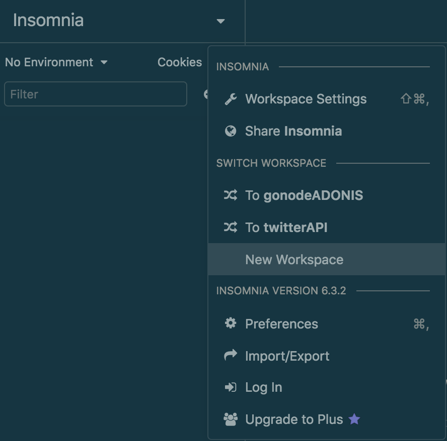

# Bulding an API with AdonisJS

Hi everyone! Over this series we will be creating an API using AdonisJS, a framework used to build NodeJS applications.

To be honest I don't how many posts this series will contain because I'll be building the API while writing this tutorial but I'll try to keep each post small and concise, so it will be easy to follow up and search for each topic related to Adonis

## The building blocks first

Let's start by making sure that we have Adonis CLI installed:

### Installing AdonisJS

In your terminal, run the following command:

```shell
npm install -g @adonisjs/cli
```

You may need administrator privileges to install Adonis CLI.

Now, you're able to run the command `adonis` and it'll appear in your terminal all the commands available within Adonis CLI

```shell
Usage:
  command [arguments] [options]

Global Options:
  --env              Set NODE_ENV before running the commands
  --no-ansi          Disable colored output

Available Commands:
  addon              Create a new AdonisJs addon
  install            Install Adonisjs provider from npm/yarn and run post install instructions
  new                Create a new AdonisJs application
  repl               Start a new repl session
  serve              Start Http server
 key
  key:generate       Generate secret key for the app
 make
  make:command       Make a new ace command
  make:controller    Make a new HTTP or Websocket channel controller
  make:ehandler      Make a new global exception handler
  make:exception     Make a new exception
  make:hook          Make a new lucid model hook
  make:listener      Make a new event or redis listener
  make:middleware    Make a new HTTP or Ws Middleware
  make:migration     Create a new migration file
  make:model         Make a new lucid model
  make:provider      Make a new provider
  make:seed          Create a database seeder
  make:trait         Make a new lucid trait
  make:view          Make a view file
 route
  route:list         List all registered routes
 run
  run:instructions   Run instructions for a given module
```

## Creating a new application

With the CLI installed we'll be able to crete our applications. In this case, we will create a Restfull API. Let's start by running adonis' `new` command

```bash
adonis new -h
```

With this, we'll be able to see all the options available when creating a new application:

```shell
Usage:
  new <name> [options]

Arguments:
  name                Name of the project directory

Options:
  --api-only          Scaffold project for api server
  --api               Scaffold project for api server
  --slim              Scaffold smallest possible Adonisjs application
  --blueprint [value] Path to github project blueprint
  --branch [value]    Specify git branch for project blueprint
  --skip-install      Do not install modules from npm
  --yarn              Use yarn over npm for modules installation
  --cnpm              Use cnpm over npm for installation
  --raw               Disable animations and colored output

About:
  Create a new AdonisJs application
```

For this tutorial, as we'll be creating an API let's use the option `--api-only`. 

```shell
adonis new schedulerapi --api-only
```

After having the project created let's start our server. So first we change to our project directory, that was created by adonis

```shell
cd schedulerapi
```

And start our server:

```shell
adonis serve --dev
```

By passing the option `--dev` will enable nodemon, that's a library used to watch changes in your files and refresh the server with the new alterations.

Your command will return an address where your server is running, probably `http://127.0.0.1:3333/`. Open this in your browser and you'll se a JSON returned, as we are just creating an API and won't need any views

```json
{"greeting":"Hello world in JSON"}
```

### Setting up our database

Let's make a quick configuration of the database we'll be using. For this project we'll use a **relational** database and in my case I'll use MySQL because it's the one I have installed in my machine, but feel free to use any relational database you want, like Postgres or sqlite3.

So head, to our file responsible for configuring the database in our project, that's located in the `config` folder. The file is `database.js`. Now open this file and you'll notice that it's exporting three configurations, for: `MySQL`, `PostgreSQL`, and `Sqlite`. Notice that above each configuration we have a block of comment telling which package we need to install, depending on the database you'll use.

As I'll be using MySQL, I just need to run:

```shell
npm i --save mysql
```

If you're using PostgreSQL, then run:

```shell
npm i --save pg
```

And if you're using sqlite:

```shell
npm i --save sqlite3
```

Perfect! With your package installed, head to our file **.env** (in the root of our project) to set the variables to correctly connect to our database:

```javascript
DB_CONNECTION = [mysql, sqlite, pg]
DB_HOST = YOUR_LOCALHOST_ADDRESS
DB_PORT = YOUR_PORT
DB_USER = YOUR_DB_USER
DB_PASSWORD = YOUR_DB_PASSWORD
DB_DATABASE= YOUR_DATABASE_NAME
```

You'll only need to set these variables. Just make sure you create the database with a name according to the one you're setting the variable `DB_DATABASE`.

Save this file and now run the migrations using:

```shell
adonis migration:run
```

Now if you head to your GUI, that you're using to manage your databases, in my case I use **sequel pro** you'll see that your database has new tables:


### Creating our first controller

Now let's explore a bit about controllers by creating a user sign-up controller. By default, when you first create an Adonis application, as we are doing here, it'll come pre-configured with a user model, as most applications requires some kind of user interaction.

Now let's create a controller that will contain the bussiness logic to save a new user to our database. Head over to your terminal and type:

```shell
adonis make:controller User
```

This will show up, asking to select a controller for HTTP requests or websocket channel:

```shell
> Select controller type (Use arrow keys)
  For HTTP requests
  For Websocket channel
```

Let's select HTTP requests

```shell
✔ create  app/Controllers/Http/UserController.js
```

If you succeed in creating the controller you'll see the message above. Now, inside your Controllers folder (located inside app folder) you'll see another folder called **Http** and *finally* inside it you'll have your `UserController.js`

Now, to make our controller work with our model, inside our controller file we need to import the model file, in our case, the user model. So, after `'use stric'` let's require our model:

```javascript
const User = use('App/Models/User')
```

Now inside our class `UserController` let's start by adding our first method that will deal with saving the new user to our database. Let's call it **store()**.

Inside our methods, we have access to a variable called `ctx`, that's a variable that contains the context of the request.

By using destructuring we'll work with the `request` of this context:

```javascript
class UserController {
  async store ({ request }) { ... }
```

Now, using `request` we are able to gather some data coming from this request by using the method `only()` from the request

```javascript
class UserController {
  async store ({ request }) {
    // request data coming from the request
    const data = request.only()
    }
```

By using the `request.only()` we are able to tell what fields of data we want to get from the request.

First, let's see what data the user is supposed to send. Let's go our user migration data, located in **database** folder:

```shell
|-- factory.js
`-- migrations
    |-- 1503250034279_user.js
    `-- 1503250034280_token.js
```

The file we are looking for is `1503250034279_user.js`. Open the file and you'll see the following:

```javascript
{ ...some code ... }
class UserSchema extends Schema {
  up () {
    this.create('users', (table) => {
      table.increments()
      table.string('username', 80).notNullable().unique()
      table.string('email', 254).notNullable().unique()
      table.string('password', 60).notNullable()
      table.timestamps()
    })
  }
{ ...more code... }
```

So the user will send me an `username`, an `email` and a `password`. Now let's get back to our `UserController.js` file.

As a parameter for `request.only()` we will pass an array of the values we want to get in the request, in our case, username, email and password

```javascript
class UserController {
  async store ({ request }) {
    // request data coming from the request
    const data = request.only(['username', 'email', 'password'])
    }
```

Before creating a new user, let's check in our database if the username used to create the new account has already been used:

```javascript
// looking for user in database
const userExists = await User.findBy('email', data.email)
```

If you look in Adonis documentation you'll see you have a method called `findByOrFail()` but I'll use only `findBy()` because I want to send a message in case the user already exists.

```javascript
// if user exists don't save
      if (userExists) {
        return response
          .status(400)
          .send({ message: { error: 'User already registered' } })
      }
```

And finally, if the user is not registered we save him in our database:

```javascript
// if user doesn't exist, proceeds with saving him in DB
      const user = await User.create(data)
```

Your user controller is probably like this now:

```javascript
class UserController {
  // creating and saving a new user (sign-up)
  async store ({ request, response }) {
    try {
      // getting data passed within the request
      const data = request.only(['username', 'email', 'password'])

      // looking for user in database
      const userExists = await User.findBy('email', data.email)

      // if user exists don't save
      if (userExists) {
        return response
          .status(400)
          .send({ message: { error: 'User already registered' } })
      }

      // if user doesn't exist, proceeds with saving him in DB
      const user = await User.create(data)

      return user
    } catch (err) {
      return response
        .status(err.status)
        .send(err)
    }
  }
}
```

I just forgot to mentio before that I wrapped the main code in a `try block` and in case any unexpected error occur we capture it inside the `catch (err) block` and returna response showing the error.

### Routing

Now that we created our first controller it's time to test it and for this we'll learn how to work with routes in Adonis

When you created the app you have a file called `routes.js` that it is located in the `start folder` in the root of your project

Open `routes.js` and clean all the code inside. 

To work with routing in Adonis we'll need to import the Route from Adonis using the `use()` functi

```javascript
'use strict'

const Route = use('Route')
```

To create a user we must send a POST request. When we access http://127.0.0.1/3333/users we'll send this request:

```javascript
Route.post('users', 'UserController.store')
```

The first parameter of `post()` is the url that will trigger the controller and the second parameter is the controller itself

For the url you can use `users` or `/users`. Both options will work

To access a certain method of a controller you just need to type the name of the controller, in our case is `UserController` and the name method's name: `UserController.store`

To make the requests in our application I'll use Insomnia REST client. You can download it here: https://insomnia.rest/download/

When you firts open Insomnia you'll see something like this:


Let's start by creating a new workspace, so we can create and store our configured requests:

Just click in the down arrow next to "Insomnia".


Now select "New Workspace" in the dropdown menu




I'll call my workspace as "schedulerAPI"

Now click on the "plus simbol" that's located just below the "cookies":


I'll create a folder called 'User' and create a new post request called 'store'

To change the request's type click in `GET` and select `POST` in the dropdown menu


Now right below `POST` you'll see a dropdown menu called "Body", click it and select JSON.

As we saw before, we need to send in our request the `username`, `email`, and `password`. 

```json
{
	"username": "Danilo",
	"email": "me@danmiranda.io",
	"password": "123456"
}
```

Now, in Insomnia let's tell to which address we need to send the request.


To make our life easier, so we don't need to type in every new request we create the full address http://127.0.0.1:3333, let's set a environment variable that we can use inside Insomnia:


Let's call it `base_url` and put our root address:

```json
{
  "base_url": "http://127.0.0.1:3333"
}
```

Just click `Done` to save

Now in our address bar just type `base_url` and `/users`, like this


Now click `Send` to send our request

You'll see in the right side of Insomnia that our request returned the created user just like we told it to do:


Let's test our already created user. If I send the request again, with the same email it'll return an error:


That's it for now, let's continue after

So to review everything we learned:

- Install AdonisJS
- Create a new aplication with Adonis
- Configure database to properly work with our Adonis application
- Create our first controller
- Create our first route
- Send a request to our API with Insomnia

